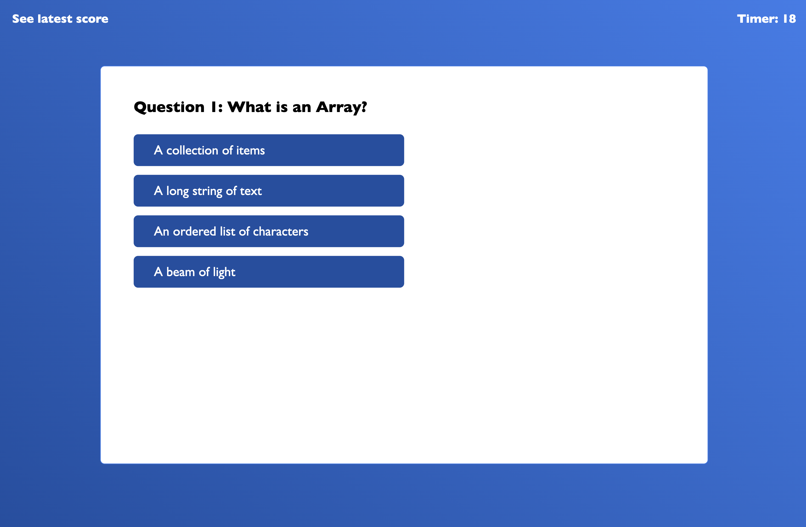

# Code-Quiz

This project utilizes JavaScript to create a Quiz Game. This game allows users to take a timed quiz and able to save results to local storage and view results.

It solves the following acceptance criterias:

## GIVEN I am taking a code quiz

- WHEN I click the start button
THEN a timer starts and I am presented with a question

- WHEN I answer a question
THEN I am presented with another questio

- WHEN I answer a question incorrectly
THEN time is subtracted from the clock

- WHEN all questions are answered or the timer reaches 0
THEN the game is over

- WHEN the game is over
THEN I can save my initials and score

### Screenshot of the project

### Link to deployed site

[Code Quiz](https://ericnguyen23.github.io/Code-Quiz/)
